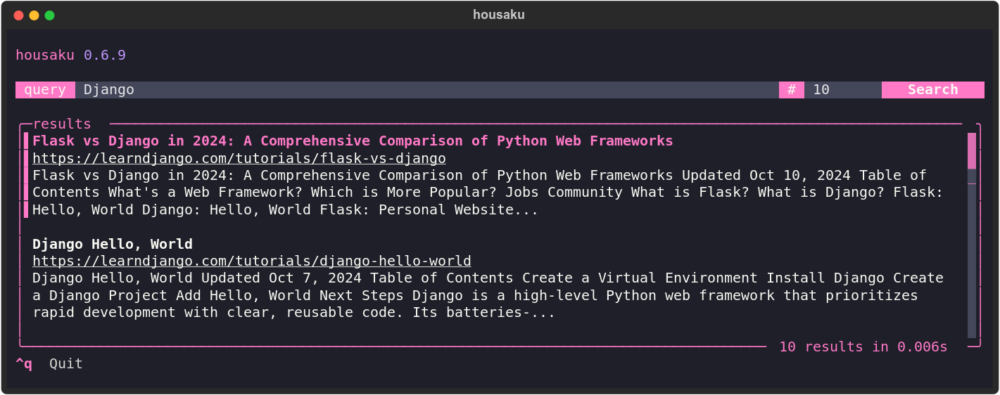

# Housaku (豊作 「ほうさく」)

Housaku is a personal search engine built on top of SQLite's FTS5 that lets you search your documents and favorite feeds in one place.



> Housaku is currently in early development, so you can expect some incompatible changes and other minor issues when updating. Once version `v1.0.0` is reached, my goal is to focus on stability and avoiding breaking changes.

## Features

- Support for the following file formats:
  - Plain text files.
  - Markdown.
  - CSV.
  - PDF.
  - EPUB.
  - DOCX.
  - XLSX.
  - PPTX.
- Support for RSS/Atom feeds parsing and indexing.
- Parallel file processing.
- Concurrent feed processing.
- Web UI.
- Modern TUI.
- Easy-to-use CLI.
- Theming (only for the TUI).
- Relevant results powered by the BM25 algorithm.
- Automatically updates files that had been modified since the last indexing session.

> I will try adding support for additional file formats like ODT. I'm also exploring the possibility of indexing posts from your Bluesky feeds and Mastodon.

## Technologies used

- [aiohttp](https://docs.aiohttp.org/en/stable/index.html).
- [click](https://click.palletsprojects.com/en/stable/).
- [FastAPI](https://fastapi.tiangolo.com).
- [feedparser](https://feedparser.readthedocs.io/en/latest/).
- [pydantic](https://docs.pydantic.dev/latest/).
- [pymupdf](https://pymupdf.readthedocs.io/en/latest/)
- [rich](https://rich.readthedocs.io/en/stable/introduction.html).
- [SQLite](https://www.sqlite.org/index.html).
- [SQLite's FTS5 extension](https://sqlite.org/fts5.html).
- [textual](https://www.textualize.io).

## Why

Every time I need to search for something, I find myself feeling a bit frustrated with the experience. Web search results have become increasingly inconsistent, and I often spend more time looking for what I truly want or need than I did before. Searching my personal files is also not a great experience. While programs like Obsidian, which I use for the majority of my personal notes, are somewhat better, the experience is still slower, and the results rely on a simple pattern matching. Additionally, searching for a specific piece of content in documents outside my vault, such as my university notes, PDFs, presentations, or my personal library of books, becomes nearly impossible.
That is why I decided to build Housaku. I wanted an easy-to-use and easy-to-maintain program that would allow me to search all my documents and favorite feeds from a single location without having to worry about format or location. I also wanted my results to be relevant to my search queries, not just based on basic pattern matching or a regular expression.

## Installation

The recommended way of installing Housaku is by using [uv](https://github.com/astral-sh/uv):

```bash
uv tool install --python 3.13 housaku
```

Now you just need to run:

```bash
housaku --help
```

To upgrade, use:

```bash
uv tool upgrade housaku

# Or

uv tool upgrade housaku --reinstall
```

### Using `pipx`

To install Housaku using `pipx`, simply run:

```bash
pipx install housaku
```

### Via `pip`

You can also install Housaku using pip, but the exact command will depend on how your environment is set up. In this case, the command should look something like this:

```bash
python3 -m pip install housaku
```

### Configuration

Before you start using Housaku, the first step is to edit the `config.toml` file located at your `$XDG_CONFIG_HOME/housaku/config.toml`. This file is generated automatically the first time you run `housaku` and will look something like this:

```toml
# Welcome! This is the configuration file for Housaku.

# Available themes include:
# - "dracula"
# - "textual-dark"
# - "textual-light"
# - "nord"
# - "gruvbox"
# - "catppuccin-mocha"
# - "textual-ansi"
# - "tokyo-night"
# - "monokai"
# - "flexoki"
# - "catppuccin-latte"
# - "solarized-light"

theme = "dracula"

[files]
# Directories to include for indexing.
# Example: include = ["/home/<user>/documents/notes"]
include = []

# Patterns to exclude from the indexing
# Example: exclude = ["*.tmp", "backup", "*.png"]
exclude = []

[feeds]
# List of RSS/Atom feeds to index
# Example: urls = ["https://example.com/feed", "https://anotherexample.com/rss"]
urls = []
```

> The folder that holds the configuration file as well as the SQLite database is determined by the `get_app_dir` utility. You can read more about it [here](https://click.palletsprojects.com/en/stable/api/#click.get_app_dir).

An easy way to open your `config.toml` file is to run the following command:

```bash
housaku config
```

## Usage

### Help

The best way to see which commands are available is to run `housaku` with the `--help` flag.

```bash
housaku --help
```

You can also learn more about what a specific command does by running:

```bash
housaku [command] --help

# Like for example

housaku index --help
```

### Config

The `config` command is a very simple command that just open the `config.toml` file using the default editor.

```bash
housaku config
```

### Index

After you have configured the list of directories containing the documents you want to index, as well as the list of feeds from which you want to fetch the posts, you can run:

```bash
housaku index
```

### Filtering content

To index only your files, use the following command:

```bash
housaku index --include files
```

To index only your feeds:

```bash
housaku index --include feeds
```

> You can specify both options to index files and feeds together, but this is equivalent to simply running the `index` command without any options.

### Parallelism

You can also change the number of threads being used when indexing your files and documents:

```bash
housaku index -t 8
```

> I recommend to stick with the default number of threads.

At the moment, indexing files is done in parallel, which makes the process faster but also introduces some complications. For example, canceling the indexing process is not recommended at the moment. My advice is to index small folders if you want to test the tool, or simply allow the indexing process to finish. In my case, I have about 7,000 documents, including markdown files, PDF, and EPUB files, as well as a large list of approximately 150 feeds. The entire process takes about 10 to 15 minutes.

### Search

#### The `search` command

The simplest way to start searching your documents and posts is by using the `search` command:

```bash
houskau searh --query "Django AND Postgres"
```

You can also limit the number of results by using the `--limit` option which, by default, is set to 10:

```bash
housaku search --query "Django AND Postgres" --limit 20
```

If you don't specify a `query` using the `--query/-q` options you will be prompted to enter one.

> You can learn more about the query syntax [here](https://sqlite.org/fts5.html#full_text_query_syntax).

#### Using the TUI

My favorite and recommended way to search is by using the TUI. To start it, just run:

```bash
housaku tui
```

> To exit the TUI just press `ctrl + q`, and to open a search result, press `Enter` while the result is highlighted.

#### Using the Web UI

Housaku also has a very simple Web UI that you can access by running:

```bash
housaku web
```

> The default port is `4242`.

This searching method have some limitations. For example, you can't open results that link to your personal files. In the future, I will try to solve this limitations, but for now please keep this in mind.

### `vacuum` and `purge`

The `vacuum` command is used to optimize the SQLite database by reclaiming unused space and improving performance. To run the vacuum command, simply execute:

```bash
housaku vacuum
```

The `purge` command is used to completely clear all data from the database. This command is useful when you want to reset the database to its initial state.

```bash
housaku purge
```

> Be careful before using both of these commands since they will have a direct impact on the data you hold in your database.

## Contributing

Contributions are welcomed! If you have any suggestions feel free to open an issue.
