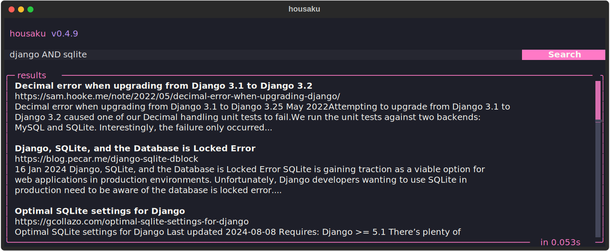

# Housaku (豊作)

Housaku is a powerful yet simple personal search engine built on top of SQLite's FTS5.



## Features

- **Support for multiple file formats**: Index files in a variety of formats, including:
  - Plain text files.
  - Markdown.
  - PDF.
  - EPUB.
  - DOCX, XLSX and PPTX.
  - CSV.
- **Basic Web scraping**: In addition to personal files, you can also index posts from your favorite RSS/Atom feeds.
- **Parallel file processing**: Housaku utilizes multi-threading to process files simultaneously, making the indexing process incredibly fast.
- **Powered by SQLite's FTS5**: Built on the advanced full-text search capabilities of SQLite's FTS5 extension.
- **Incremental indexing**: Only new documents are indexed.
- **Relevant sesults with BM25**: Search results are sorted using the BM25 algorithm, ensuring the most relevant results.
- **Web UI**: Search using your favorite web browser thanks to a friendly and modern Web UI.
- **TUI**: A simple but easy-to-use TUI made with Textual that enhances the command-line experience.

## WIP

Housaku is in active development, and some aspects need further refinement before I can consider the project "stable." This includes the TUI, which requires some polishing, and the Web UI, which needs significant improvements.

## Motivation

As someone who stores a wealth of documents on my hard drive—ranging from academic PDFs to personal notes in Obsidian—I often found it challenging to search across multiple applications and file types. I wanted a solution that would allow me to search not only my notes but also important books in my Calibre library and blog posts from my favorite feeds. This inspired me to build Housaku.

## Install

### Via `pip`

```bash
pip install housaku
```

### Via `pipx`

```bash
pipx install housaku
```

### Via `uv`

```bash
uv tool add housaku

# Or

uvx housaku
```

## Usage

### Configuration

To start using Housaku, the first step is to edit the `config.toml` file located at `$XDG_CONFIG_HOME/housaku/config.toml`. This file is generated the first time you run `housaku` and will look something like this:

```toml
# Welcome! This is the configuration file for housaku.

[files]
# Directories to include for indexing.
# Example: include = ["/home/<user>/documents/notes"]
include = []

# Patterns to exclude from the indexing
# Example: exclude = ["*.tmp", "backup", "*.png"]
exclude = []

[feeds]
# List of RSS/Atom feeds to index
# Example: urls = ["https://example.com/feed", "https://anotherexample.com/rss"]
urls = []
```

> Notes: This folder will also contain the SQLite database where all the indexed data will be stored.

To open your `config.toml` file, you can just run the following command:

```bash
housaku config
```

### Indexing

Once you have configured your directories and/or feeds, run the following command to start the indexing process.

```bash
housaku index
```

If you want to specify directories for indexing when running the `index` command, use the `-i` option. For example:

```bash
housaku index -i "/home/<user>/Documents/notes" -i "/home/<user>/Documents/vault/"
```

### Search

To perform a search, you just need to use the following command:

```bash
housaku search --query "search engine"

# By default the limit is 20
housaku search --query "search engine" --limit 5
```

### TUI

You can also search using the TUI. To start using it just run:

```bash
housaku tui

```

### Web

To start the Web UI, simply run:

```bash
housaku web

# You can also specify the port
housaku web --port 8787 # by default is 4242
```

## Contributing

Contributions are welcome! If you have suggestions for improvements or new features, feel free to open an issue.
