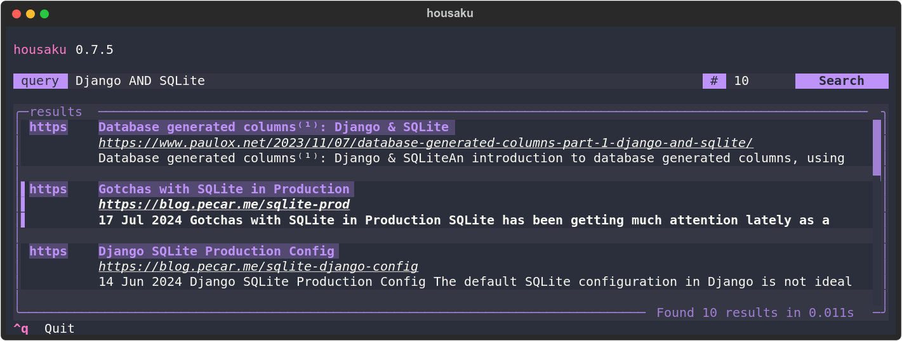
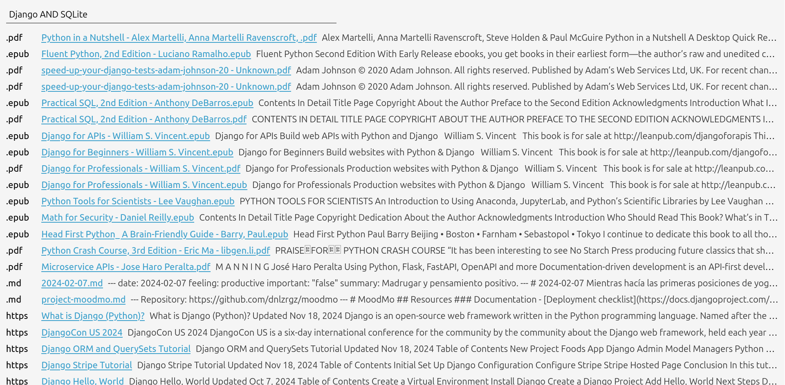

# Housaku (豊作 「ほうさく」)

Housaku is a personal search engine built on top of SQLite's FTS5 that lets you query your documents, books, PDFs, favorite feeds and more all in one place.



> Housaku is in early development, so you can expect some incompatible changes and other minor issues when updating. Once version `v1.0.0` is reached, my goal is to focus on stability and avoiding breaking changes as much as possible.

## Features

- Support for multiple file formats like `.txt`, `.md`, `.csv`, `.pdf`, `.epub`, `.docx`, `.xlsx` and `.pptx`.
- Support for RSS/Atom feeds parsing and indexing.
- Parallel file processing.
- Concurrent feed processing.
- Web UI.
- Modern TUI with support for theming.
- Easy-to-use CLI.
- Relevant results powered by the BM25 algorithm.
- Support for incremental updates.

> Support for file formats like `.odt` is coming as well as the possibility of indexing posts from Bluesky feeds and Mastodon.

## Stack

- [SQLite's FTS5 extension](https://sqlite.org/fts5.html).
- [SQLite](https://www.sqlite.org/index.html).
- [Starlette](https://www.starlette.io).
- [aiohttp](https://docs.aiohttp.org/en/stable/index.html).
- [click](https://click.palletsprojects.com/en/stable/).
- [feedparser](https://feedparser.readthedocs.io/en/latest/).
- [pydantic](https://docs.pydantic.dev/latest/).
- [pymupdf](https://pymupdf.readthedocs.io/en/latest/)
- [rich](https://rich.readthedocs.io/en/stable/introduction.html).
- [textual](https://www.textualize.io).

## Motivation

The first reason I decided to start working on Housaku was to learn more about the basics of full-text search and how search engines operate under the hood. In fact, if you look at the commit history, you can see that initially, all the parsing, tokenization and TF/IDF calculations were handled "manually" before I opted to use SQLite's FTS5 solution due to performance.

The second and final reason was the large volume of documents I was managing. I have ~5,000 notes in Obsidian, formatted in Markdown, a couple of hundred books in my Calibre library, mainly in `.epub`, a significant number of PDFs, and PowerPoint presentations from my computer science degree at UNED. Additionally, I also have a vast collection of RSS feeds that I have subscribed to for a long time. So, I wanted/needed an efficient and easy way to search through all of this documents without having to worry about the specifics of where each of them was located or in what format.

## Installation

The recommended way of installing Housaku is by using [uv](https://github.com/astral-sh/uv):

```bash
uv tool install --python 3.13 housaku
```

Now, you just run:

```bash
housaku --help
```

To upgrade, use:

```bash
uv tool upgrade housaku

# Or

uv tool upgrade housaku --reinstall
```

### Using `pipx`

To install Housaku using `pipx`, simply run:

```bash
pipx install housaku
```

> Just remember that the minimal version of Python required is `>=3.13`.

### Via `pip`

You can also install Housaku using pip, but the exact command will depend on how your environment is set up. In this case, the command should look something like this:

```bash
python3 -m pip install housaku
```

### Configuration

Before you start using Housaku, the first step is to edit the `config.toml` file located at your `$XDG_CONFIG_HOME/housaku/config.toml`. This file is generated automatically the first time you run `housaku` and will look something like this:

```toml
# Welcome! This is the configuration file for Housaku.

# Available themes include:
# - "dracula"
# - "textual-dark"
# - "textual-light"
# - "nord"
# - "gruvbox"
# - "catppuccin-mocha"
# - "textual-ansi"
# - "tokyo-night"
# - "monokai"
# - "flexoki"
# - "catppuccin-latte"
# - "solarized-light"

theme = "dracula"

[files]
# Directories to include for indexing.
# Example: include = ["/home/<user>/documents/notes"]
include = []

# Patterns to exclude from the indexing
# Example: exclude = ["*.tmp", "backup", "*.png"]
exclude = []

[feeds]
# List of RSS/Atom feeds to index
# Example: urls = ["https://example.com/feed", "https://anotherexample.com/rss"]
urls = []
```

> The folder that holds the configuration file as well as the SQLite database is determined by the `get_app_dir` utility. You can read more about it [here](https://click.palletsprojects.com/en/stable/api/#click.get_app_dir).

An easy way to open your `config.toml` file is to run the following command:

```bash
housaku config
```

## Usage

### Help

The best way to see which commands are available is to run `housaku` with the `--help` flag.

```bash
housaku --help
```

You can also learn more about what a specific command does by running:

```bash
housaku [command] --help

# For example:

housaku index --help
```

### Config

The `config` command is a very simple command that just open the `config.toml` file using the default editor.

```bash
housaku config
```

### Index

After you have configured the list of directories containing the documents you want to index, as well as the list of feeds from which you want to fetch the posts, you can run:

```bash
housaku index
```

#### Filtering content

To index only your files, use the following command:

```bash
housaku index --include files
```

To index only your feeds:

```bash
housaku index --include feeds
```

> You can specify both options to index files and feeds together, but this is equivalent to simply running the `index` command without any options.

#### Parallelism

You can also change the number of threads being used when indexing your files and documents:

```bash
housaku index -t 8
```

> My recommendation is to stick with the default number of threads.

At the moment, indexing files is done in parallel using multi-threading, which makes the process faster but also introduces some complications. For example, cancelling the indexing half-way using `ctrl+c` will cause some threads to exit while others will continue running in the background and then fail.

### Search

#### The `search` command

The simplest way to start searching your documents and posts is by using the `search` command:

```bash
houskau searh --query "Django AND Postgres"
```

You can also limit the number of results by using the `--limit` option which, by default, is set to 10:

```bash
housaku search --query "Django AND Postgres" --limit 20
```

If you don't specify a `query` using the `--query/-q` options you will be prompted to enter one.

> You can learn more about the query syntax [here](https://sqlite.org/fts5.html#full_text_query_syntax).

#### Using the TUI

My favorite and recommended way to search is by using the TUI. To start it, just run:

```bash
housaku tui
```

> To exit the TUI just press `ctrl + q`, and to open a search result, press `Enter` while the result is highlighted.

#### Using the Web UI

Housaku also has a very simple Web UI that you can access by running:

```bash
housaku web
```



> The default port is `4242`.

This searching method have some limitations. For example, you can't open results that link to your local documents.

### `vacuum` and `purge`

The `vacuum` command is used to optimize the SQLite database by reclaiming unused space and improving performance. To run the vacuum command, simply execute:

```bash
housaku vacuum
```

The `purge` command is used to completely clear all data from the database. This command is useful when you want to reset the database to its initial state.

```bash
housaku purge
```

> Be careful before using both of these commands since they will have a direct impact on the data you hold in your database.

## Contributing

Contributions are welcomed! If you have any suggestions feel free to open an issue.
